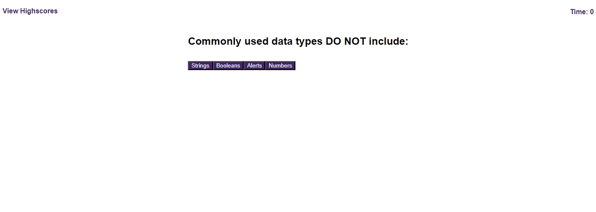

# m4-web-api-code-quiz
A short quiz. Using web API the user can answer a series of questions and save their score/time alongside initials. The quiz can be retaken and the scoreboard can be cleared.

https://benacooper.github.io/m4-web-api-code-quiz/

